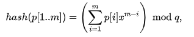
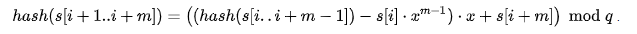
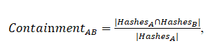

### Алгоритм проверки кода на плагиат
В файле "Readme.md" были кратко освещены основные шаги алгоритма. Дадим их подробное описание:
1) Генерализация(иначе - токенизация) кода: 
* Замена названий всех функций на func (кроме функций из стандартной библиотеки, идущих "сами по себе", а не являющихся членами какого- либо класса. Пример:
```
std::string name = "Asya";
size_t pos = name.find('A');// заменяется

std::string name;
std::getline(cin, name, '\n');// не заменяется
```
* Исключение комментариев из документа
* Исключение всех переносов, строк, пробелов и отступов
* Все строковые константы заменяются на str, а символьные - на chr
* Замена всех имен переменных на их тип
* Все целочисленные типы заменяются на int
* Все типы чисел с плавающей точкой заменяются на double
* Все строковые и символьные типы заменяются на char
* Все контейнеры stl и другие типы из стандартной библиотеки заменяются в соотсетствии с:
```
// Заменяются на array
		std::unordered_set <std::string> stlArrays = {
		"array",
		"vector",
		"deque",
		"forward_list",
		"list"
	};
// Заменяются на map
	std::unordered_set <std::string> stlMap = {
		"map",
		"multimap",
		"unordered_map",
		"unordered_multimap"
	};
// Заменяются на set
	std::unordered_set <std::string> stlSet = {
		"set",
		"multiset",
		"unordered_set",
		"unordered_multiset"
	};
// Заменяются на queue
	std::unordered_set <std::string> stlAdap = {
		"stack",
		"queue",
		"priority_queue"
	};
```
* Все определенные пользователем в классах и структурах типы, а также нижеследующие типы из стандартной библиотеки заменяются на type:
```
std::unordered_set <std::string> anotherTypes = {
		"bool",
		"mutex",
		"condition_variable",
		"istringstream",
		"ostringstream"
		"ifstream",
		"ofstream"
	};
```
* Исключаются все namespace
* Замена конструкций типа ++i; --i; i+=5 на более общие.
* Исключаются все ссылки, указатели, указатели на ссылки и т.д.
ЧТО НЕ ПОДДЕРЖИВАЕТ ДАННЫЙ АЛГОРИТМ (это не значит, что весь процесс ломается - просто результаты будут несколько иными):
1) AUTO
2) STD::LOCK_GUARD
3) STD::ALLOCATOR
4) STD::ITERATOR
5) Функции и типы переменных из сторонних библиотек
6) Уверена, что забыла еще какой- нибудь тип объектов из стандартной библиотеки, но только потому, что я им не пользовалась. 
Таким образом,асимптотическая сложность этого алгоритма - O(x), где x - число символов в файле. Изначально я пыталась реализовать всё за один проход по тексту, но впоследствии поняла, что это достаточно сложно, поэтому решила использовать и дополнительную память, и дополнительные проходы по документу. Амортизированная сложность добавления k элементов в конец вектора - O(k), следовательно, эта операция, выполняемая дважды, также не повлияла на асимптотическую сложность токенизации. Типы данных, переменные и функции хранятся в хэш-таблицах, поэтому обращение к ним - O(1).


2) Поиск отпечатков
* Пусть h - длина "окна", а k - длина подстроки, для которой вычисляется hash. Мы используем метод просеивания, поэтому необходим параметр h. В качестве h я беру 10, а в качестве k -6 (экспериментально подобранные значения). 
* hash(x) - функция, которая выдает одни и те же значения на одинаковых наборах входных данных, причем эти значения равномерно распределены на числовой оси. Я подсчиываю кольцевую хэш- функцию из алгоритма Карпа-Рабина, вычисляемую по формулам:




В качестве парамера q по рекомендации в статье (для использования побитовых операций вместо модульной арифметики) было выбрано 31-е простое число Мерсенна. Число x выбирается случайно из диапазона от 0 до q-1 перед началом работы программы, и я почему- то взяла его равным 19. 
* Нас интересуют подпоследовательности символов длины k. Очевидно, что для документа длины l всего будут существовать w = l - k + 1 таких подпоследовательностей. Сложность вычисления хэша подстроки из k сиволов- O(1), следовательно, для всего документа- O(l - k). 
* В каждом "окне" - последовательности значений hash- функций длины h- выбирается минимальное, причем это минимальное не должно повторять выбранное в предыдущем окне значение.В противном случае такое значение просто не включается в отпечаток. Так вычисляется отпечаток документа. На каждом шаге выбор минимального осуществляется за O(h). Всего шагов - (l-k+1-h+1). Следовательно, сложность этой операции O((l-k-h)*h). Обозначим максимальное число выбранных минимальных хэшей за m.
3) Сравнение отпечатков документов
* Сортируем набор хэшэй за O(m1*logm1) и O(m2* logm2) (здесь m1 и m2 - число хэшей в отпечатках первого и второго документов соответственно), а затем вычисляем повторяющиеся значения хэшэй СЛИЯНИЕМ ОТСОРТИРОВАННЫХ СПИСКОВ - за O(m1+m2). Cуществуют формулы, определяющие степень присутствия и отсутсвия документа в документе:


 Однако после их подсчета необходимо вернуться к первоначальным хэшам и попытаться расширить совпадающие области в документах.Необходимо рассмотреть все пары совпавших хэшей среди отпечатков двух документов. Для каждой такой пары находятся положения хэшей в обоих документах, и можно считать, что области, по которым были вычислены данные хэши, совпадают между собой. Затем алгоритм пытается расширить области, осуществляя проверку соседних значений хэшей на границах этих областей в обоих документах. В случае, если пограничные хэши совпадают, область расширяется. Процесс повторяется до тех пор, пока значения хэшей на границах совпадающих областей не станут различаться. В самом "страшном" случае (когда все хэши совпали) мы сравним все соответствующие друг другу хэши первого и второго документов (то есть мы пройдемся по хэшам меньшего документа).Сложность этого мероприятия - O(l-k)(предположим, что длина токенизированной строки l меньше, чем длина токенизированной строки второго документа).
 Именно эти два значения (число совпавших хэшей/число хэшей в каждом из двух документов) и будут возвращены пользователю как мера плагиата (каждое из них, умноженное на 100, представляет собой процент плагиата, т.к. из вышеизложенной логики никак не может превышать 1). 

