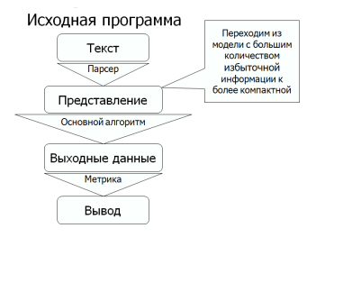

# Общий вид программы для поиска плагиата

Для разработки алгоритмов на выявление плагиата сначала необходимо определиться с тем, в какой форме будет представлен анализируемый код программы. И здесь существует несколько подходов, наиболее оптимальным из которых принято считать метод ТОКЕНИЗАЦИИ. Тем не менее, я приведу список моделей представления программ:
* ТОКЕНИЗАЦИЯ КОДА
	Главная идея данного метода заключается в том, чтобы 	избавиться от всех незначительных, но сохранить все 	значимые элементы кода программ. Алгоритм действий 	таков:
		1) Каждому оператору(который не является опреандом),
		   подключенем библиотек, заголовочным файлам 			   приписывается некоторый код (определенный          		   заранее)
		2) Из полученного набора кодов строится строка с 			   сохранением последовательности следования 			   операндов
* ИСХОДНЫЙ КОД
	Код рассматривается без внесения изменений, однако в 	таком случае возникают проблемы с нахождением плагиата 	при переименовывании функций и переменных.
* ПАРАМЕТРИЗОВАННЫЙ КОД
	При первой встрече с названием функции или переменной они 	заменяются на 0, при последующих - на расстояние до 	предыдущей позиции.
	Этот способ однозначно работает лучше, чем анализ кода 	как есть, а также демонстрирует преимущества по сравнению 	со следующим способом, так как позволяет находить плагиат 	даже в том случае, если скопирован только кусок кода. Тем 	не менее, на практике токенизация лучше справляется со 
	своей задачей.
* КОД КАК ЭЛЕМЕНТ N-МЕРНОГО ПРОСТРАНСТВА
	Код данной программы - точка n- мерного пространтсва. 	
	Каждая координата - характеристика (например, число 
	циклов). Сравнение расстояний между точками и дает ответ 
	на вопрос о плагиате. Основные недостатки - большое число
	false positives, полное отсутствие результата при 	копировании части кода.   

Итак, проанализируем СЛОЖНОСТЬ ТОКЕНИЗАЦИИ. Будем хранить заранее определенные значения кодов для операторов в хэш - таблице. Тогда для каждого элемента кода нужно будет осуществлять поиск по хэш- таблице и, в случае обнаружения соответсвующего оператора(подключения заголовка, библиотеки)добавить значение, хранящееся в хэш-таблице, к токенизированной строке. Поскольку поиск по хэш- таблице в среднем осуществляется за O(1), то наш алгоритм будет ЛИНЕЙНЫМ по сложности (O(n), где n - количество символов кода, ведь для токенизации нам достаточно будет несколько раз пройти по коду программы).
 
# Алгоритм для проверки кода на плагиат
 
| Тип алгоритма | Особенности |
| ------ | ------ |
| Текстовые | Разбивают исходный текст на токены и работают с ними |
| Структурные | Используют структуру, например, синтактическое дерево (Данный подход является эффективным для обнаружения участков кода, которые не изменяют своей структуры в различных файлах, что наблюдается довольно редко) |
| Семантические | Синтез первых двух методов |

### К чему должен быть устойчив хороший алгоритм проверки кода на плагиат:
* Изменение комментариев
* Переименовывание функций и переменных
* Переставление блоков кода
* Изменение количества переносов строк, пробелов и отступов
* Изменение типов переменных или возвращаемых значений функций 
* Замена строковых и символьных констант

### Актуальные сегодня алгоритмы поиска плагиата
* ЖАДНОЕ СТРОКОВОЕ ЗАМОЩЕНИЕ( сложность алгоритма в худшем случае - O(n^3), на практике намного ниже - O(n^2)). Используется в функционирующем детекторе плагиата JPlag.
Рассмотрим данный алгоритм подробнее в документе TheGreendyStringTiling.md. 
* Алгоритм, использующий абстрактое синтаксическое дерево 
Рассмотрим данный алгоритм подробнее в документе AbstractSyntaxTree.md.
* Алгоритм, основанный на методе отпечатков.
Наиболее популярный и распространенный на сегодняшний день алгоритм, позволяющий 
даже на больших базах сравниваемых документов получать почти линейную зависимость скорости от количества сравниваемых файлов (практический результат), - алгоритм, базирующийся на методе отпечатков. Именно ввиду хорошей работы этого алгоритма на БОЛЬШОЙ БАЗЕ документов я отдала ему предпочтение. 

Рассмотрим последовательность шагов этого алгоритма:
* Генерализация исходного кода
* Поиск и сравнение отпечатков
* Поиск совпадений

Каждый из этапов описан более детально в файле "ALGORITM.md", а входные параметры и запуск программы - в "START.md".
 